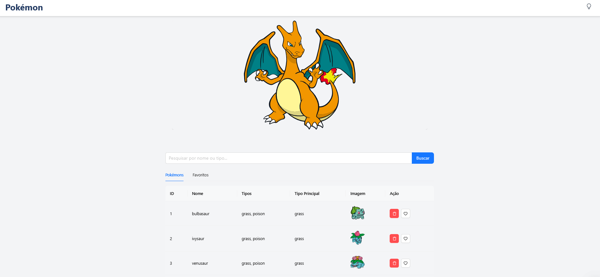

# Pokémon Table

## Descrição do Projeto

Este é um projeto que exibe uma tabela interativa de Pokémon, permitindo aos usuários visualizar dados sobre Pokémon, incluindo nome, tipos, foto e ações como adicionar e remover favoritos. Ele utiliza a API pública do [PokeAPI](https://pokeapi.co/), React, Ant Design e outras tecnologias para criar uma interface rica e interativa. O projeto também permite que os usuários alterem a visualização para mostrar apenas seus Pokémon favoritos.

## Funcionalidades

- Exibição de Pokémon com dados como nome, tipos, foto e tipo principal.
- Sistema de favoritos: adicionar e remover Pokémon da lista de favoritos.
- Pesquisa de Pokémon por nome ou tipo principal.
- Navegação entre páginas com paginador.
- Tabela com funcionalidade de filtro, adição e remoção de Pokémon favoritos.
- Modo claro e escuro.
- Utiliza Ant Design para componentes de UI, como tabelas, botões e input de pesquisa.

## Tecnologias Usadas

- **React**: Biblioteca para construção da interface.
- **TypeScript**: Para garantir maior segurança de tipos no código.
- **Ant Design**: Framework de UI para componentes como `Table`, `Button`, `Pagination` e `Input`.
- **Axios**: Para realizar chamadas HTTP à API do PokeAPI.
- **Tailwind CSS**: Para estilizar o projeto com classes utilitárias.
- **React Hooks**: Para gerenciar estados e efeitos colaterais.
- **LocalStorage**: Para armazenar os favoritos localmente.

## Interface do Projeto  

Veja abaixo algumas capturas de tela do projeto em funcionamento:  

### Página Principal  
  

### Pesquisa de Pokémon  
  


# Acesse o Projeto Online
O projeto pode ser acessado através do link:

https://pokemontablelist.netlify.app/

## Passos para Rodar Localmente

Siga os passos abaixo para rodar este projeto localmente em sua máquina:

### 1. Clone o repositório:

```bash
git clone https://github.com/afschagas/pokemon-table.git
cd pokemon-table
npm install
npm start

O projeto será iniciado em http://localhost:3000
